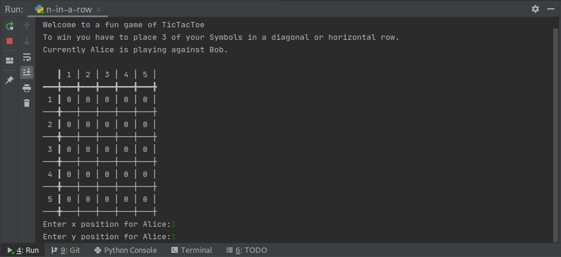

# N-Tac-Toe
A terminal based n-in-a-row game.
The game can be played by two players and has a customisable boardsize and winning threshold.
To win the player has to place his symbols in a horizontal, vertical or diagonal row.

