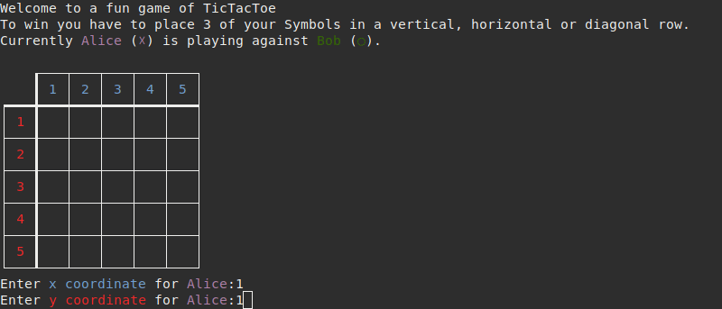
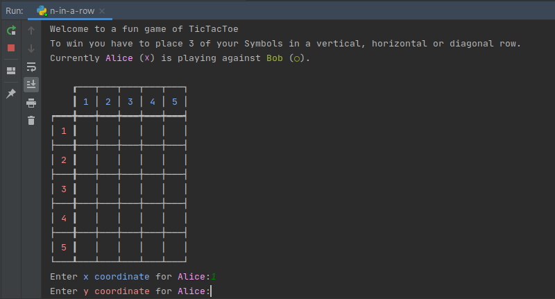
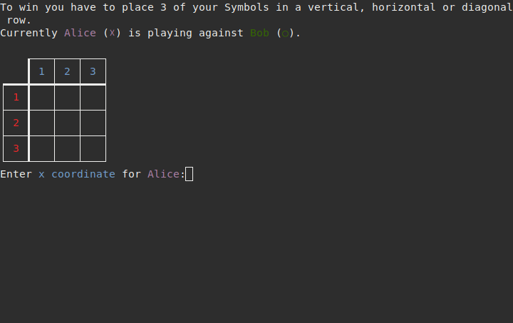

# N-Tac-Toe

A terminal based n-in-a-row game.
The game can be played by two players and has a customisable boardsize and winning threshold.
To win the player has to place his symbols in a horizontal, vertical or diagonal row.

## Setup
0. Download this repository from github or directly clone it.
`git clone https://github.com/BendiXB/N-Tac-Toe.git`
1. For the numpy version install dependency: `pip3 install numpy`
2. Run n-tac-toe.py with Python3. `python3 n-in-a-row.py` or `n-in-a-row-numpy.py`
