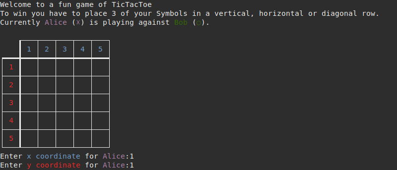

# N-Tac-Toe
A terminal based n-in-a-row game.
The game can be played by two players and has a customisable boardsize and winning threshold.
To win the player has to place his symbols in a horizontal, vertical or diagonal row.

## Dependencies
This project is dependent on numpy.
It can be installed numpy via pip.
`pip3 install numpy`

## Setup
0. Download this repository from github or directly clone it.
`git clone https://github.com/BendiXB/N-Tac-Toe.git`
1. Install Numpy. `pip3 install numpy`
2. Run n-tac-toe.py with Python3. `python3 n-tac-toe.py`